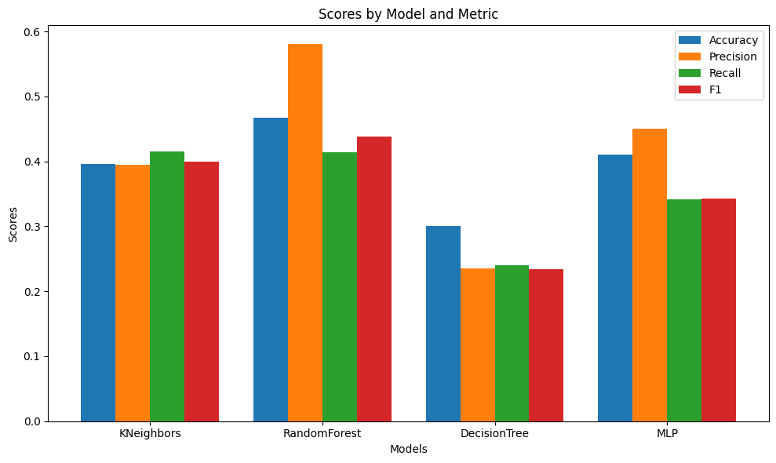

# Mini-Project for Fundamentals of Machine Learning Course

This repository contains the code and data for a mini-project on facial expression recognition using machine learning algorithms.

## 📑 Project Policy
- Team: group should consist of 3-4 students.

    |No.| Student Name    | Student ID |
    | --------| -------- | ------- |
    |1|Phạm Ngọc Trai|21110196|
    |2|Đặng Hải Anh|21110240|
    |3|||
    |4|||

- The submission deadline is strict: **11:59 PM** on **June 22nd, 2024**. Commits pushed after this deadline will not be considered.

## 📦 Project Structure

The repository is organized into the following directories:

- **/data**: This directory contains the facial expression dataset. You'll need to download the dataset and place it here before running the notebooks. (Download link provided below)
- **/notebooks**: This directory contains the Jupyter notebook ```EDA.ipynb```. This notebook guides you through exploratory data analysis (EDA) and classification tasks.

## ⚙️ Usage

This project is designed to be completed in the following steps:

1. **Fork the Project**: Click on the ```Fork``` button on the top right corner of this repository, this will create a copy of the repository in your own GitHub account. Complete the table at the top by entering your team member names.

2. **Download the Dataset**: Download the facial expression dataset from the following [link](https://mega.nz/file/foM2wDaa#GPGyspdUB2WV-fATL-ZvYj3i4FqgbVKyct413gxg3rE) and place it in the **/data** directory:

3. **Complete the Tasks**: Open the ```notebooks/EDA.ipynb``` notebook in your Jupyter Notebook environment. The notebook is designed to guide you through various tasks, including:
    
    1. Prerequisite
    2. Principle Component Analysis
    3. Image Classification
    4. Evaluating Classification Performance 

    Make sure to run all the code cells in the ```EDA.ipynb``` notebook and ensure they produce output before committing and pushing your changes.

5. **Commit and Push Your Changes**: Once you've completed the tasks outlined in the notebook, commit your changes to your local repository and push them to your forked repository on GitHub.


Feel free to modify and extend the notebook to explore further aspects of the data and experiment with different algorithms. Good luck.

## 🌠 Result Report

There are 5 models I've used in this mini-project. 
* Machine Learning Model: KNeighborsClassifier, RandomForestClassifier, DecisionTreeClassifier
* MLP Model
* Convolutional Neural Network (TensorFlow)

Consider evaluating 3 Machine Learning Model and 1 MLP Model: Based on the evaluation metrics, the *```RandomForestClassifier```* model will perform best and the *```DecisionTreeClassifier```* will perform worst on testing dataset. The reason I can assume this is because there is a difference between each model's accuracy score when the test dataset is fed into the model for them to predict. Moreover, the *```RandomForestClassifier```* model is identified as the best-performing among four models because it achieves the highest scores in accuracy and precision, which are crucial for correctly identifying both positive and negative cases with high confidence. 

Nevertheless, the performance of the four models mentioned above was not efficient. Therefore, based on my self-study process, I utilized the *```Convolutional Neural Network```* using ```TensorFlow library```, which achieved higher accuracy scores compared to all of previous models.


<div align="center">
    
|No.| Model                      | Accuracy | Precision | Recall | F1-score
|:-:| -------------------------- | :------: | :-------: | :----: | :------: 
| 1 |KNeighborsClassifier        | 0.40     | 0.39      | 0.42   | 0.40
| 2 |RandomForestClassifier      | 0.47     | 0.58      | 0.41   | 0.44
| 3 |DecisionTreeClassifier      | 0.30     | 0.24      | 0.24   | 0.23
| 4 |MLPClassifier               | 0.41     | 0.45      | 0.34   | 0.34
| 5 |Convolutional Neural Network| 0.56 | - | - | - 

</div>

## 🫠 Interesting findings (I guess)
While working with the MLP model, I encountered significant delays during hyperparameter optimization using ```GridSearchCV``` with the entire training set of the ```MLP Model```. To address this issue, I devised a strategy to speed up the process by sampling subsets of both the original and transformed datasets. By randomly selecting indices for subsampling, I ensured that the sample training dataset retained the appropriate sample label associations. 

Since the samples vary each time the code block runs, I tested the model's performance multiple times to ensure consistency. The model with the params after doing hyperparameter optimization taken from doing ```GridSearchCV``` with the sample datasets still perform better than default model. 

Based on the tests conducted, it appears that performing hyperparameter optimization using sampled datasets has minimal impact on the final outcome. Despite using smaller subsets, the model still manages to achieve optimal parameters that enhance performance compared to the default settings. This approach significantly reduces runtime because it focuses computational resources on smaller representative datasets, thereby accelerating the optimization process.
